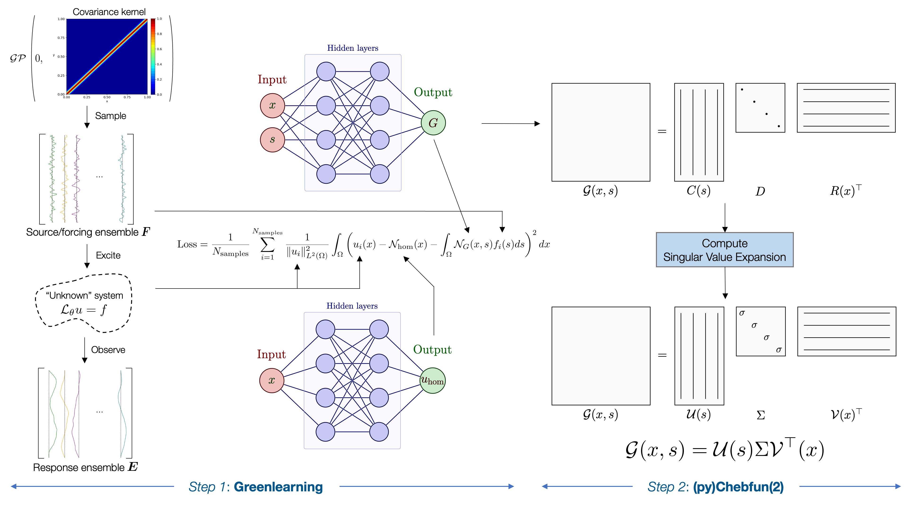

# ChebGreen

ChebGreen is a **Python** library for learning and interpolating Green's function for 1-Dimensional problems in a continuous sense. It builds on our initial working on [learning and interpolating Green's functions using a manifold interpolation technique](https://www.sciencedirect.com/science/article/pii/S0045782523000944). The main idea is to learn a Green's function using Rational Neural Networks ([Greenlearning](https://greenlearning.readthedocs.io/en/latest/)), use our **Python** implementation of [chebfun](https://www.chebfun.org/) to learn a *continuous* Singular Value Expansion (SVE) for the bivariate Green's function, and then interpolate SVE on a manifold of *Quasimatrices*. Here's a small schematic to outline the first part of the process:



We use [chebpy](https://github.com/chebpy/chebpy) as a starting point to implement a **Python** version of [chebfun](https://www.chebfun.org/). The necessary features of chebfun in 2-Dimensions have been implemented along with bug fixes for chebpy. The implementation for the Rational Neural Networks to learn Green's functions is done in **Pytorch**.

## Installation

The recommended way of installing the stack used for runnings this code is in a conda environement:

```bash
conda create -n chebGreen
conda activate chebGreen

conda install jupyterlab

# Install pytorch. Choose the appropriate conda installation here: https://pytorch.org/get-started/locally/
# As an example, for me the installer is:
conda install pytorch::pytorch torchvision torchaudio -c pytorch

conda install scipy
conda install numpy
conda install matplotlib
```

The code uses **MATLAB** and the **MATLAB** library Chebfun to generate the datasets. Instructions for installation can be found here:
- https://www.mathworks.com/products/matlab.html
- https://www.chebfun.org/download/

## Usage

The maintained code is inside the ``main`` folder. It is further subdivided into ``chebGreen`` which contains the main code, ``datasets`` which contains the datasets generated by the **MATLAB** scripts, and ``scripts`` which contains the afforementioned scripts for data generation. One can also load a dataset generated from another simulation software or from experiments, the format for the datasets is specified in ``chebGreen/model.py``. The code saves the learned **PyTorch** models into a folder called ``savedModels`` (this is not tracked by git). There is a **Tensorflow2** version of the code for the Rational Neural Network but we will not be maintaining it going forward.

The code to learn and interpolate Green's function from a given Partial Differential Equation is inside ``Jupyter`` notebooks which run the main code, provides important visualizations for the learned Green's function, and computes an empirical error.